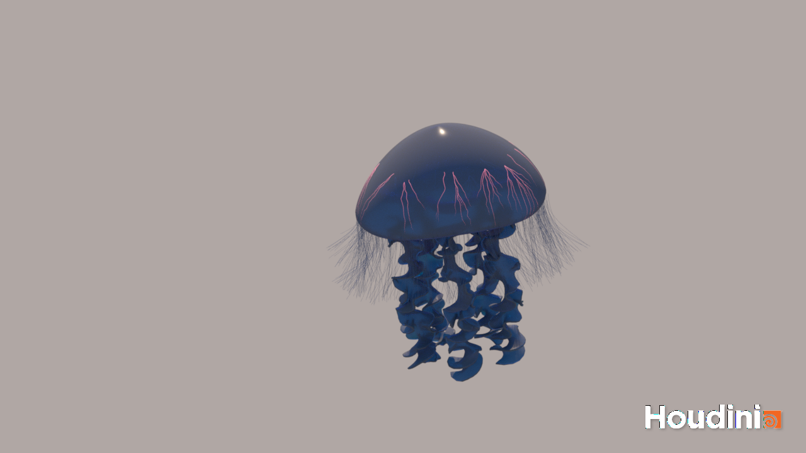

# Procedural Jellyfish
Avi Serebrenik

The full res render can be found at Renders/jelly.mp4, but here is a gif version and the first frame:

This jellyfish was created in Houdini and rendered there with Karma XPU.
It is made up of a bell, arms, veins, organs, and hair/tentacles.
